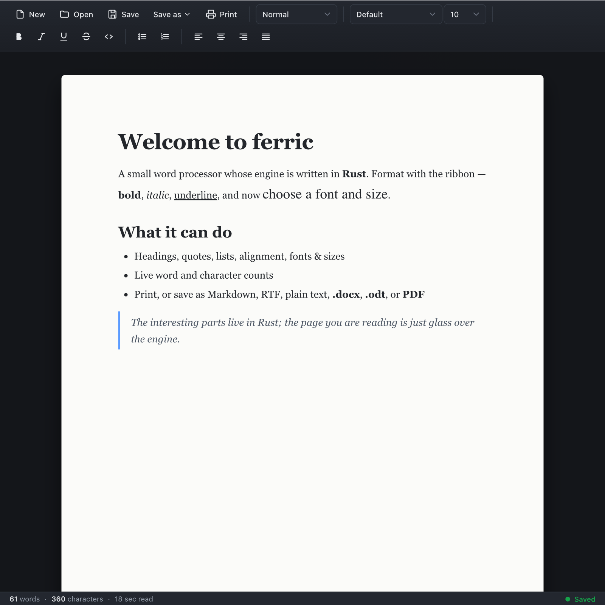

# ferric

> A word processor in the shape of a limited Microsoft Word — headings,
> **fonts and sizes**, bold/italic/underline, lists, alignment, live word
> counts — that **prints** and **exports real files you can open anywhere**:
> Markdown, RTF, plain text, a genuine **`.docx`**, an **OpenDocument `.odt`**,
> and a paginated **PDF**. The page you type on is glass; the machinery
> underneath is iron — it is written in **Rust**.

**By Daniel Bracher · [@danieldevelopes-collab](https://github.com/danieldevelopes-collab)**
· MIT licensed · Rust + Tauri · cross-platform desktop app



**Run it:** `cargo tauri dev`. **Try the engine alone:** `cargo test -p ferric-core`.

---

## What it does

- **Type and format.** Bold, italic, underline, strikethrough, inline code.
- **Choose a font and size.** A font-family picker (Georgia, Times New Roman,
  Helvetica, Arial, Courier New, Verdana, Garamond, …) and a point-size picker,
  applied to your selection and carried all the way into every export.
- **Structure.** Heading 1/2/3, normal text, block quotes, bullet & numbered
  lists, a code block; left / centre / right / justified alignment.
- **Live counts.** Words, characters and an estimated reading time, always
  visible in the status bar.
- **Open** Markdown, plain text, and ferric's own JSON.
- **Print** — the system print dialog, which on every OS also offers
  *Save as PDF*, giving pixel-perfect output of the page as you see it.
- **Save / export** to **Markdown**, **RTF**, **plain text**, ferric JSON, a
  real **`.docx`** (Microsoft Word / Google Docs / LibreOffice), an
  **OpenDocument `.odt`** (LibreOffice Writer / OpenOffice), and a paginated
  **PDF** generated in Rust.

It is deliberately *limited* — no tables, images, comments or track-changes yet
— and it is honest about that. But the things it does, it does for real.

---

## "Does it actually work?" — yes, and here's the proof

The export engine doesn't fake formats by renaming files. Running the bundled
example (`cargo run -p ferric-core --example export`) writes a document to every
format, and the operating system's own `file` tool recognises each one:

```
ferric_sample.pdf:   PDF document, version 1.3, 1 pages
ferric_sample.odt:   OpenDocument Text
ferric_sample.docx:  Microsoft Word 2007+
```

The `.odt` unzips to a correct `mimetype` / `META-INF/manifest.xml` /
`content.xml` / `styles.xml`; the `.docx` is valid Office Open XML; the PDF is a
genuine, paginated PDF with wrapped text and real fonts. The engine's test suite
(12 tests, all green) asserts these headers and round-trips on every build.

---

## How it's built — and why that's the interesting part

A word processor is, underneath, a **document model** and a pile of **file-format
conversions** — exactly the kind of work that rewards a precise type system and
thorough tests. So ferric splits cleanly:

```
crates/ferric-core/   ← the engine (pure Rust, no UI): the model + every format
src-tauri/            ← a thin Tauri shell: opens a window, exposes 4 commands
src/                  ← the web UI: a Word-like ribbon + a contenteditable page
```

The engine and the UI exchange exactly one thing — a **`Document`** as JSON:

```
Document  = { paragraphs: [ { style, align, runs: [ { text, bold, italic, font, size, … } ] } ] }
```

The UI never parses a file format and the engine never touches the DOM. Press
**Save as .docx** (or `.odt`, or PDF) and the page is serialised to a
`Document`, handed to Rust, and `ferric-core` builds the bytes: Office Open XML
via the `docx-rs` crate, OpenDocument XML zipped by hand, and a paginated PDF
laid out with `printpdf` (word-wrapping with Helvetica metrics, per-run fonts,
headings, lists and page breaks). All the logic that could be wrong lives in
Rust, behind tests; the four Tauri commands are a dozen lines each.

`ferric-core` has **no dependency on Tauri** — you can convert documents between
Markdown, RTF, `.docx`, `.odt`, PDF, text and JSON from any Rust program (see
`crates/ferric-core/examples/export.rs`).

---

## Why I built a word processor — in Rust

A word processor looks mundane and is secretly deep. Behind the blinking cursor
sit problems that have humbled real engineers for fifty years: a text model that
stays correct as you splice formatting across selections; faithful conversion
between formats that each encode the *same* idea — a bold word — in completely
different ways; layout and pagination; Unicode. It is a perfect crucible for a
language, because *correctness is visible*: a dropped byte, a malformed zip, a
broken `.docx`, and the illusion collapses.

I built it in Rust on purpose. The part of a word processor most likely to
betray you is the file I/O — the moment your document leaves the program and has
to be exactly right for some other application to open. Rust is built for
exactly that kind of "must not be subtly wrong" code: its type system makes
malformed states hard to represent, and its tests run on every build. The result
is an engine where "Save as PDF" or "Save as .odt" isn't a hope — it's a
property the compiler and the test suite keep honest. The polished page is the
showcase; the engine is the point.

---

## A history of Rust — and what it means for the world

It is worth understanding what the engine of this program is *made of*, because
the story of Rust is one of the more consequential things to happen to software
in a generation.

### How it came about
Rust began around **2006** as the personal side-project of **Graydon Hoare**, a
programmer then at Mozilla. The origin story he tells is almost too neat: the
software running the elevator in his building had crashed — again — because, like
most critical software, it was written in a language where a single mistake with
a pointer can corrupt memory and bring everything down. It bothered him that in
2006 the world still built its most important systems on foundations that could
fail that way. He named the language **Rust**, after the *rust fungi* — organisms
that are robust, distributed, and almost comically over-engineered for survival.

**Mozilla** began sponsoring the project in **2009**, betting that a safer
systems language could be the foundation for a safer web browser, and the
language was announced publicly in **2010**. To prove it under fire, Mozilla
built **Servo**, an experimental browser engine written entirely in Rust; its
parallel CSS engine, **Stylo**, shipped inside **Firefox Quantum in 2017** — Rust
running, at last, in front of hundreds of millions of people.

### The idea that made it matter
Most languages give you a choice. You can have the raw speed and control of C and
C++ — and with it the eternal risk of memory-safety bugs (use-after-free,
double-free, buffer overruns, data races). Or you can have the safety of a
garbage-collected language like Java or Go — and pay for it with a runtime and
less control. Rust's central insight is that you can have **both**: the speed and
control of C, with memory safety guaranteed **at compile time**, and **no garbage
collector**.

It does this with **ownership and borrowing**, enforced by the famous **borrow
checker**. Every value has a single owner; references ("borrows") are checked so
they can never outlive the data they point at, and you can never have aliasing
and mutation at the same time. There is no `null` — absence is the explicit
`Option` type — so the "billion-dollar mistake" simply doesn't exist. Whole
categories of bug that have caused decades of crashes and security breaches are
turned into **compile errors you fix before the program ever runs**, with
**zero runtime cost** — Rust's "fearless concurrency" and "zero-cost
abstractions."

### Growing up
Rust reached **1.0 on 15 May 2015**, with a stability promise; its **edition**
system (2015, 2018, 2021, 2024) then let the language keep evolving without
breaking old code. It grew a culture famous for its open **RFC process**, a
welcoming community, and superb tooling — **`cargo`** (the build tool and package
manager, created by **Carl Lerche** and **Yehuda Katz**) and **crates.io** made
sharing and building Rust code genuinely pleasant. For roughly **eight years
running**, developers voted Rust the **most-loved / most-admired language** in
Stack Overflow's global survey.

When Mozilla's 2020 restructuring hit the Rust team, the language's future was
secured by the creation of the independent **Rust Foundation (2021)**, with AWS,
Google, Microsoft, Huawei and Mozilla among its founding members — a signal that
Rust now belonged to the industry, not one company.

### What it means for the world
This is the part that reaches beyond programmers. Study after study from
**Microsoft** and **Google** found that roughly **70% of serious security
vulnerabilities** in large C and C++ codebases are *memory-safety* bugs — the
exact class Rust eliminates by construction. As Google adopted Rust in
**Android**, the share of memory-safety vulnerabilities in new code fell sharply.
**AWS** (Firecracker, Bottlerocket), **Cloudflare**, **Discord**, **Dropbox**,
**Meta** and **Microsoft** (rewriting parts of Windows) now run Rust in
production. In **2022**, the **Linux kernel** — the software at the heart of most
of the internet, phones and servers on Earth — accepted Rust as a second
language alongside C, the first such addition in over thirty years.

And governments noticed: in **2024** the US Office of the National Cyber Director
and **CISA** urged the industry to move to **memory-safe languages**, naming Rust
specifically. So Rust is not merely a nicer way to write programs. It is part of
a deliberate, worldwide effort to make the digital infrastructure civilisation
now depends on fundamentally harder to crash and harder to attack — to build
software, finally, that is over-engineered for survival. That is the metal
ferric is forged from.

---

## A short history of the word processor

- **1964** — IBM markets the **MT/ST**; the phrase "word processing" comes from
  IBM's German *Textverarbeitung*, attributed to **Ulrich Steinhilper**.
- **1974** — at **Xerox PARC**, **Charles Simonyi** and **Butler Lampson** write
  **Bravo**, the first WYSIWYG word processor.
- **1976** — **Michael Shrayer**'s **Electric Pencil**, the first word processor
  for a home computer.
- **1978** — **Rob Barnaby**'s **WordStar** dominates the early PC era.
- **1979** — **Alan Ashton** & **Bruce Bastian** create **WordPerfect**.
- **1983** — **Charles Simonyi** (from Bravo) and **Richard Brodie** ship
  **Microsoft Word**, the app ferric gently imitates.
- **The formats:** Microsoft's **RTF** (~1987) and **.doc**, then the open
  **OOXML / `.docx`** (ECMA-376 / ISO 29500, 2007); the **OpenDocument** family
  (`.odt`, an OASIS / ISO standard); and **Markdown** (**John Gruber** with
  **Aaron Swartz**, 2004). ferric reads and writes across that half-century.

---

## Run it

Install [Rust](https://rustup.rs) and the [Tauri prerequisites](https://tauri.app/start/prerequisites/)
for your OS (macOS: Xcode CLT; Linux: `webkit2gtk`; Windows: WebView2).

```bash
cargo install tauri-cli --version "^2"   # once
cargo tauri dev                          # run the app
cargo tauri build                        # build a release binary

cargo test -p ferric-core                # test the engine (no GUI)
cargo run -p ferric-core --example export # write sample files in every format
```

---

## Credits & acknowledgements

ferric stands on a lot of other people's work; corrections welcome — these are
sincere thanks.

**Rust & its people** — **Graydon Hoare**, who started it; **Mozilla**, who
sponsored it; **Carl Lerche** & **Yehuda Katz** for `cargo`; the **Rust
Foundation** and the thousands of contributors who steward the language and
compiler today.

**The frameworks & crates that do real work**
- **Tauri** (the Tauri Working Group) — a Rust app with a web UI and a tiny
  footprint.
- **`docx-rs`** (*bokuweb*) — Office Open XML for `.docx`.
- **`printpdf`** (Felix Schütt & contributors) — the paginated PDF layout.
- **`zip`** (the zip-rs maintainers) — the archive container behind `.odt`.
- **`pulldown-cmark`** (**Raph Levien** & contributors) — Markdown parsing.
- **`serde`** / **`serde_json`** (**David Tolnay** & Erick Tryzelaar) — the
  serialization that carries a `Document` everywhere.

**The pioneers & formats** — Simonyi & Lampson (Bravo), Shrayer, Barnaby, Ashton
& Bastian, Simonyi & Brodie (Word); Microsoft / ECMA (RTF, OOXML); OASIS
(OpenDocument); Adobe (PDF); Gruber & Swartz (Markdown). And **Tim Berners-Lee**
(HTML), **Brendan Eich** (JavaScript) & the WHATWG for the web platform the
editor is painted with.

---

## Honesty

- **The engine is real and tested.** `cargo test -p ferric-core` runs 12 tests
  covering the model, Markdown round-trips (incl. underline via inline HTML),
  RTF, **`.docx` / `.odt` validated as proper zip archives**, **PDF validated by
  its `%PDF` header**, font/size flowing into every export, and stats — all
  green on every build.
- **The exports are genuine files**, recognised by the OS `file` tool as PDF,
  OpenDocument Text and Microsoft Word 2007+ — not renamed look-alikes.
- **Printing & Save-as-PDF** use the system print engine via the webview, so the
  printout is exactly the page you see.
- **What it does *not* do (yet):** it exports RTF / `.docx` / `.odt` / PDF but
  does not yet *import* them; there are no tables, images, comments or
  track-changes. Stated, not hidden.
- **On verification:** the Rust engine is unit-tested, the export files are
  validated by the operating system, the Tauri shell compiles cleanly, and the
  UI is shown above. The windowed app is best experienced by running it with
  `cargo tauri dev` — a desktop window can't be screenshotted in the environment
  this was assembled in, so the *look* is proven (the web UI), the *engine* and
  its *files* are proven (tests + `file`), and the shell is proven to build.

---

## License

[MIT](LICENSE) © 2026 Daniel Bracher (danieldevelopes-collab).
